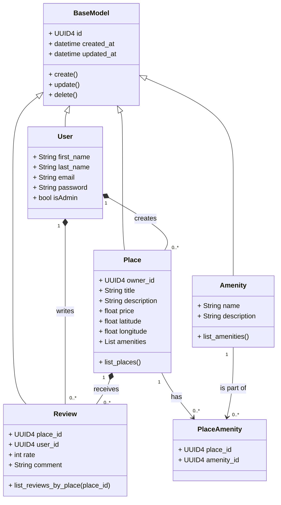
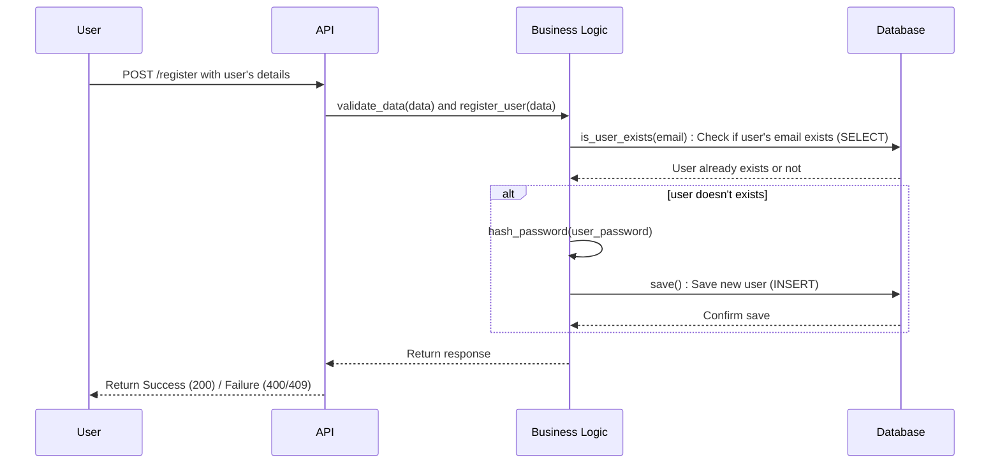
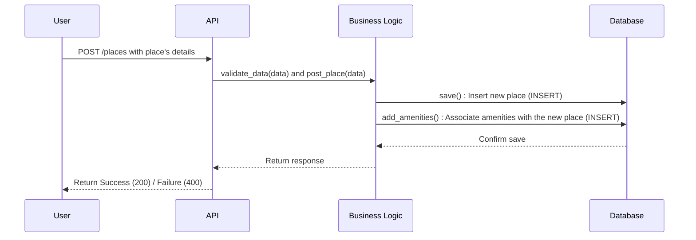
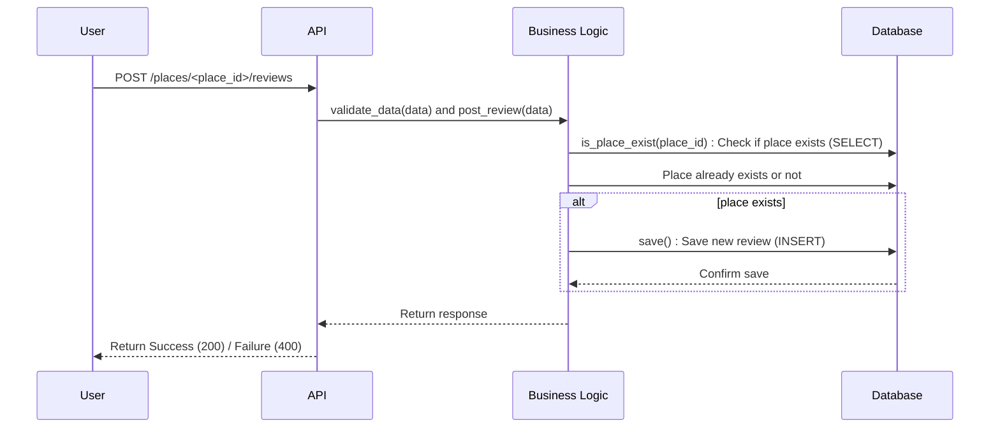
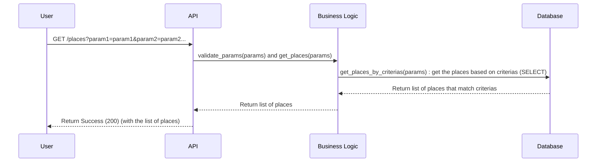

# HBnB - UML

## Introduction

This technical document serves as a comprehensive guide for the development of the HBnB Evolution project, a simplified version of a platform inspired by Airbnb. The purpose of this document is to outline the system architecture, design principles, and business logic that will drive the core features of the application. It aims to provide clear direction and structure for the implementation process.

The HBnB Evolution platform will enable users to register, manage profiles, create and manage property listings, submit reviews, and associate amenities with their properties. This document is essential in guiding developers through the technical requirements, ensuring the proper execution of functionality while aligning with business goals.

## High-Level Architecture

#### Layer Descriptions
- **Presentation Layer:**

    - Responsibility: Manages user interactions and handles API requests.
    - Key Components:
        - Service API:
            - UserController: Manages user actions like registration and profile updates.
            - PlaceController: Handles operations for places, such as creating or deleting them.
            - ReviewController: Oversees submitting and modifying reviews.
            - AmenityController: Manages actions related to amenities.

- **Business Logic Layer:**

    - Responsibility: Contains the main logic of the application and processes data.
    - Key Components:
        - HBnBFacade: Serves as a bridge between the presentation layer and the business logic.
            - Handles operations related to users, places, reviews, and amenities.
        - Model Classes:
            - **BaseModel**, **UserModel**, **PlaceModel**, **ReviewModel**, **AmenityModel**: Represent the core data entities.

- Persistence Layer:

    - Responsibility: Manages data storage and retrieval.
    - Key Components:
        - Database Access:
            - **DBStorage**: Handles creating, reading, updating, and deleting data.

#### Role of the Facade Pattern :

The HBnBFacade simplifies communication between the presentation and business logic layers. It provides a single point of access for controllers, making it easier to perform operations without needing to know the details of how they work. This helps:

- Streamline Access: Allows controllers to call complex functions easily.
- Hide Details: Keeps the inner workings of the business logic layer hidden from the presentation layer.
- Improve Maintenance: Makes it easier to update and scale the application by reducing changes needed across different layers.

## Business Logic Layer

#### Purpose of the Diagram:
This class diagram illustrates the core entities of the HBnB Evolution application, including User, Place, Review, Amenity, and PlaceAmenity, along with their relationships and shared inheritance from BaseModel. It demonstrates how these components interact to support key features such as user management, property listings, and reviews.

#### Key Components:

- **BaseModel**: A superclass providing common attributes like `id`, `created_at`, `updated_at`, and CRUD methods for all entities.
- **User**: Represents users, with details like `email`, `password`, and `isAdmin`, and creates Places and writes Reviews.
- **Place**: Represents properties, with attributes such as `title`, `price`, and a list of Amenities. Places are created by Users.
- **Review**: Represents feedback on Places, written by Users.
- **Amenity**: Represents property features (e.g., Wi-Fi, parking), linked to Places via PlaceAmenity.
- **PlaceAmenity**: Handles the many-to-many relationship between Place and Amenity.

#### Design Decisions:

Inheritance: Centralizes shared fields and methods in BaseModel, ensuring consistency across entities.
Associations: A user can create multiple places and reviews. PlaceAmenity enables a many-to-many relationship between Place and Amenity.

#### Fit into the Architecture:

This diagram defines the structural backbone for user actions, property management, and reviews in the HBnB platform, illustrating the interactions needed for the system's core functionalities.

## API Interaction Flow

#### API Call: User Registration

- Purpose: This diagram outlines the steps for registering a new user, from receiving data to saving the user and returning a response.

#### Flow of Interactions:

- User submits details to the API.
- API validates and forwards the request to Business Logic.
- Business Logic checks the Database for existing users.
- If no user exists, it hashes the password and saves the user in the Database.
- Database confirms, and the API returns a success (200) or failure (400/409) response.

Each layer collaborates to securely process the registration request.

#### API Call: Place Creation

- Purpose: This diagram shows the steps involved in creating a new place listing, from receiving data to saving the place and its amenities.

#### Flow of Interactions:

- User submits place details to the API.
- API validates and forwards the request to Business Logic.
- Business Logic saves the place in the Database.
- It then associates the relevant amenities with the place.
- Database confirms the save, and the API returns a success (200) or failure (400) response.

This ensures the place and its amenities are securely stored and linked.

#### API Call: Review Submission

- Purpose: This diagram outlines the steps for submitting a review for a specific place, from receiving the review data to saving it in the database.

#### Flow of Interactions:

- User submits a review for a place to the API.
- API validates the data and forwards the request to Business Logic.
- Business Logic checks if the place exists in the Database.
- If the place exists, Business Logic saves the review in the Database.
- Database confirms the save, and the API returns a success (200) or failure (400) response.

This process ensures that reviews are linked to valid places and are securely stored.

#### API Call: Fetching a List of Places

- Purpose: This diagram illustrates the process for retrieving a list of places based on specified criteria, enabling users to search for relevant properties.

#### Flow of Interactions:

- User sends a request to the API to fetch places with specific parameters.
- API validates the parameters and passes the request to Business Logic.
- Business Logic queries the Database to fetch places matching the given criteria.
- Database returns the list of places that match the criteria to Business Logic.
- Business Logic sends the retrieved list back to the API, which then responds to the User with a success (200) status and the list of places.

This flow ensures that users receive accurate search results tailored to their specified parameters.

