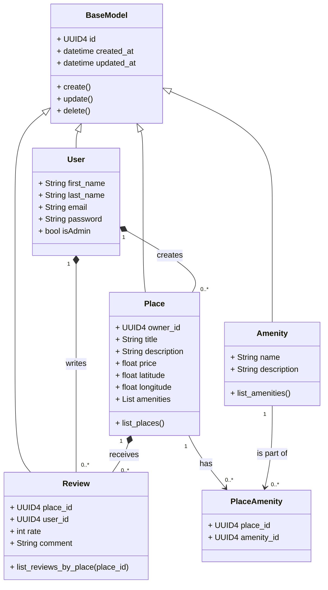
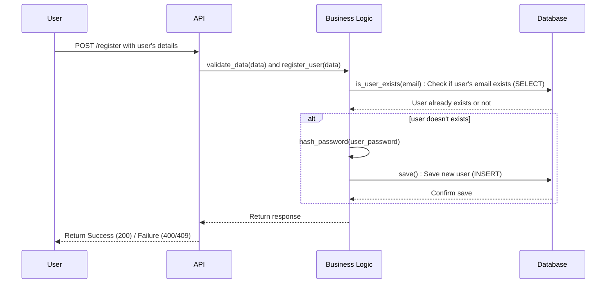
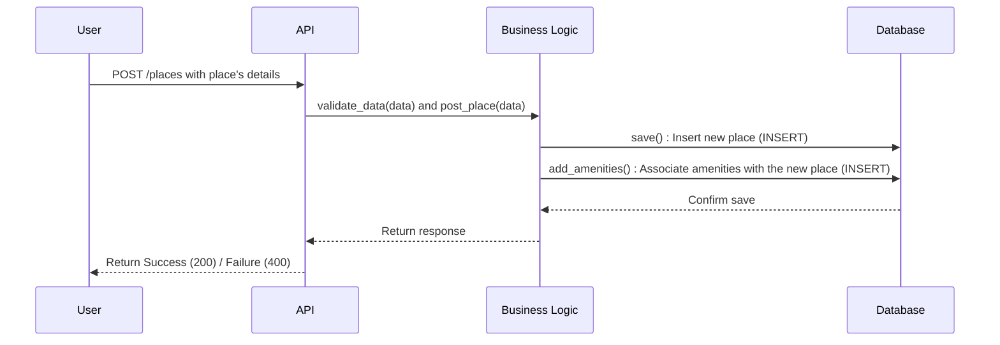
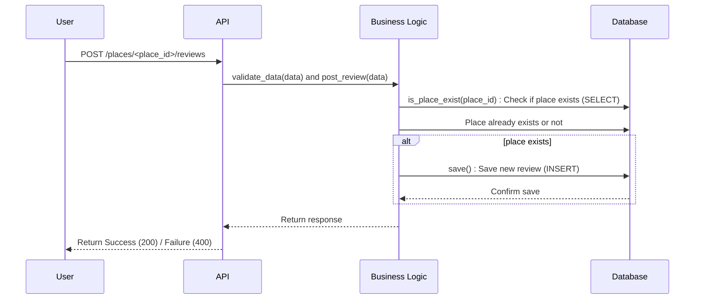
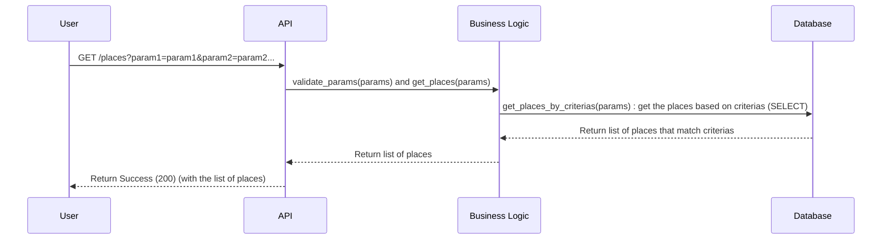

# HBnB - UML

## Introduction

## High-Level Architecture

## Business Logic Layer

```mermaid
classDiagram

    BaseModel: + UUID4 id
    BaseModel: + datetime created_at
    BaseModel: + datetime updated_at
    BaseModel: + create()
    BaseModel: + update()
    BaseModel: + delete()

    Place: + UUID4 owner_id
    Place: + String title
    Place: + String description
    Place: + float price
    Place: + float latitude
    Place: + float longitude
    Place: + List amenities
    Place: + list_places()

    User: + String first_name
    User: + String last_name
    User: + String email
    User: + String password
    User: + bool isAdmin

    Review: + UUID4 place_id
    Review: + UUID4 user_id
    Review: + int rate
    Review: + String comment
    Review: + list_reviews_by_place(place_id)

    Amenity: + String name
    Amenity: + String description
    Amenity: + list_amenities()

    PlaceAmenity: + UUID4 place_id
    PlaceAmenity: + UUID4 amenity_id

    BaseModel <|-- User
    BaseModel <|-- Place
    BaseModel <|-- Amenity
    BaseModel <|-- Review
    User "1" *-- "0..*" Place : creates
    User "1" *-- "0..*" Review : writes
    Place "1" *-- "0..*" Review : receives
    Place "1" --> "0..*" PlaceAmenity : has
    Amenity "1" --> "0..*" PlaceAmenity : is part of
```

## API Interaction Flow

```mermaid
sequenceDiagram
    participant User
    participant API
    participant Business Logic
    participant Database

    User ->> API: POST /register with user's details
    API ->> Business Logic: validate_data(data) and register_user(data)
    Business Logic ->> Database: is_user_exists(email) : Check if user's email exists (SELECT)
    Database -->> Business Logic: User already exists or not
    alt user doesn't exists
        Business Logic ->> Business Logic: hash_password(user_password)
        Business Logic ->> Database: save() : Save new user (INSERT)
        Database -->> Business Logic: Confirm save
    end
    Business Logic -->> API: Return response
    API -->> User: Return Success (200) / Failure (400/409)
```

```mermaid
sequenceDiagram
    participant User
    participant API
    participant Business Logic
    participant Database

    User ->> API: POST /places with place's details
    API ->> Business Logic: validate_data(data) and post_place(data)
    Business Logic ->> Database: save() : Insert new place (INSERT)
    Business Logic ->> Database: add_amenities() : Associate amenities with the new place (INSERT)
    Database -->> Business Logic: Confirm save
    Business Logic -->> API: Return response
    API -->> User: Return Success (200) / Failure (400)
```

```mermaid
sequenceDiagram
    participant User
    participant API
    participant Business Logic
    participant Database

    User ->> API: POST /places/<place_id>/reviews
    API ->> Business Logic: validate_data(data) and post_review(data)
    Business Logic ->> Database: is_place_exist(place_id) : Check if place exists (SELECT)
    Business Logic ->> Database: Place already exists or not
    alt place exists
        Business Logic ->> Database: save() : Save new review (INSERT)
        Database -->> Business Logic: Confirm save
    end
    Business Logic -->> API: Return response
    API -->> User: Return Success (200) / Failure (400)
```

```mermaid
sequenceDiagram
    participant User
    participant API
    participant Business Logic
    participant Database

    User ->> API: GET /places?param1=param1&param2=param2...
    API ->> Business Logic: validate_params(params) and get_places(params)
    Business Logic ->> Database: get_places_by_criterias(params) : get the places based on criterias (SELECT)
    Database -->> Business Logic : Return list of places that match criterias
    Business Logic -->> API: Return list of places
    API -->> User: Return Success (200) (with the list of places)
```